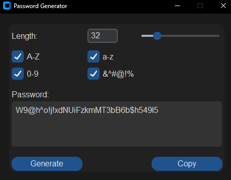

# Password Generator App

A secure and user-friendly password generator application built with Python and CustomTkinter, featuring modern UI elements and robust password generation capabilities.


## Features

- **Custom Length Control**: Generate passwords between 9-128 characters
- **Character Type Selection**:
  - Uppercase letters (A-Z)
  - Lowercase letters (a-z)
  - Numbers (0-9)
  - Special symbols (&^#@!%$*)

## Installation

1. Ensure you have Python 3.6+ installed
2. Install required packages:
```bash
pip install -r requirements.txt
``` 